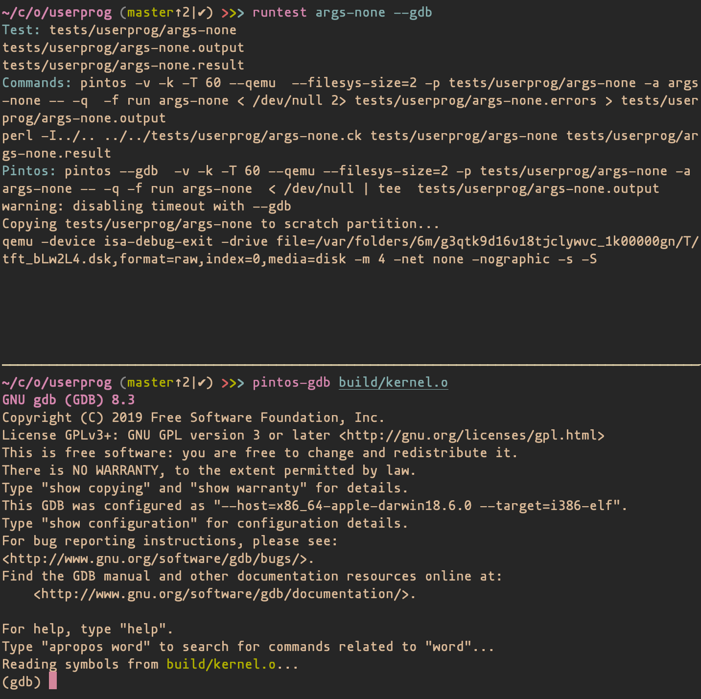

Pintos
======

Pintos labs for EE 461S at UT Austin.

### About

[Pintos](https://web.stanford.edu/class/cs140/projects/pintos/pintos_1.html) is a simple operating system developed by Stanford. You will complete [project 2 (User Programs)](https://web.stanford.edu/class/cs140/projects/pintos/pintos_3.html#SEC32), [project 3 (Virtual Memory)](https://web.stanford.edu/class/cs140/projects/pintos/pintos_4.html#SEC53), and [project 4 (File Systems)](https://web.stanford.edu/class/cs140/projects/pintos/pintos_5.html#SEC75).

Installation
------------

**You can either use the pre-configured virtual machine or install pintos on your own machine.**

- ### Use Pre-configured Ubuntu Virtual Machine

    1. Download the virtual machine image [here](https://utexas.box.com/s/yscy072figmvevzd24vtg1zr8biblzzo).
    2. Import the virtual machine image into your VM software (for example, VirtualBox) by clicking file->import.
        
            Username & Password of the Ubuntu Linux system
            username: pintos
            password: 123456
    3. In home direction, clone the repo from github.

        ```
        git clone https://github.com/dizhenhuoshan/pintos-os-fa21.git
        ```

        After doing that, your pintos project should be located at ~/pintos-os-fa21

    4. Now enter the `"pintos"` folder and use the following command to setup and change remote URL to yours.

        ```
        ./install.sh
        git remote set-url origin https://github.com/DrY-Courses/os-fa21-team-name.git
        ``` 

        Note: the `$PINTOS` and `$PATH` are already set in `".bashrc"` so the `"install.sh"` should say "Installation successful". You do not need to editor the `".bashrc"` unless it fails.

    You can move the project to wherever you want. The only thing you need to do is changing the value of `$PINTOS` in `"~/.bashrc"`.


- ### Install on your own machine

    Here are the installation instructions:

    #### Dependencies
    Pintos relies on some core utilities, a gcc that can compile for i386, the corresponding binary utilities, gdb, and qemu. To get these on Debian-derived Linux distributions, run the following commands:

    ```bash
    $ sudo apt update
    $ sudo apt install build-essential coreutils binutils gcc qemu-system-x86
    ```

    On macOS using [Homebrew](https://brew.sh):

    ```bash
    $ brew install i386-elf-gcc i386-elf-binutils i386-elf-gdb qemu
    ```

    #### Setup
    Follow the instructions from the TAs to set up your team on GitHub classroom. Then, clone your team's repository.

    ```bash
    $ git clone https://github.com/DrY-Courses/os-sp20-team-name.git
    ```

    #### Install
    Run the installation script, which will also check that you have the required programs available. Then, check that the installation went okay.

    ```bash
    $ ./install.sh  # Follow the instructions it prints
    $ echo $PINTOS  # Should point to your pintos directory
    $ echo $PATH    # Should contain the `utils` directory
    $ cd $PINTOS/userprog
    $ make check    # You should fail all of the test cases
    ```

    #### Troubleshooting
    - Run the install script again
    - Make sure your bashrc is setting the `$PINTOS` and `$PATH` variables correctly
    - Re-source your bashrc


Running Tests
-------------

All of these commands assume you are inside a project directory, such as `userprog` or `vm`.

### All tests
```bash
$ make check
```

### Individual tests
```bash
# Get into the proper project directory
$ cd $PINTOS/userprog
$ make
# View the possible tests (the executables)
$ ls build/tests/{userprog,filesys/base}
# Run whatever tests you want
$ runtest args-none syn-read
```

### Previewing your grade
```bash
$ make grade
# Or, if the file is up-to-date:
$ cat build/grade
```

Note: This script output will *not* necessarily match your grade on the lab. Some synchronization bugs may appear to be fine on your machine, but then fail when we grade the lab.

Debugging
---------

Using [GDB](https://www.gnu.org/software/gdb/documentation/), or a GDB frontend, is mandatory. The Stanford documentation has an entire [chapter on debugging tools](https://web.stanford.edu/class/cs140/projects/pintos/pintos_10.html#SEC145), including a [section on GDB](https://web.stanford.edu/class/cs140/projects/pintos/pintos_10.html#SEC15). The techniques that these describe will be very useful for debugging your operating system, so please read through them!

### Running tests
To start debugging, use the `runtest` script as described above, adding the `--gdb` flag. For example:

```bash
$ runtest args-none --gdb
```

You'll notice that the output is paused. This is because the Pintos process you just ran is waiting for you to attach your GDB debugger. Open up a new terminal tab, window, or pane. Consider learning a tool like [tmux](https://github.com/tmux/tmux/) or [GNU Screen](https://www.gnu.org/software/screen/). Then, use `pintos-gdb` to attach your GDB debugger to the running Pintos process.

```bash
# Assumes you are in the project directory.
$ pintos-gdb build/kernel.o  # optionally add the `--tui` flag
```

At this point, you should see something like this:



Next, you will have to attach GDB to the Pintos process. You can do this using the `debugpintos` macro. You may also want to load symbols from the user program (test case) to allow you to step through inside the test case. Type `debugpintos` at the prompt, followed by `loadusersymbols build/tests/userprog/args-none`. You may omit the `loadusersymbols` command if you only want to debug the kernel itself, but you **must** include `debugpintos`.


Now, GDB is ready to debug. If the Pintos process ever hangs and you are unable to kill it with control-C, try `pkill pintos`.


Project Submission
------------------

If you do not follow these steps *exactly*, you will break the grading script and lose 10 points on your lab.


1. Create a new branch for this project. `project2` is for userprog, `project3` is for vm, and `project4` is for filesys. **If you have already created the `release/projectN` branch for this project, omit the `-b` flag.**
```bash
$ git checkout -b release/project2
```

2. Push the branch.
```bash
$ git push origin release/project2
```

The grading script relies on specific file paths to find the project directory. However, it is not flexible enough to find the correct directory if, for example, you have a "vm/Makefile" and a "temp-directory/vm/Makefile." Remove unnecessary code from your project or risk breaking the grading script.

3. Tag the commit that will act as your submission.
```bash
$ git tag -a project2-submission -m "project2-submission"
```

4. Push the tag.
```bash
$ git push origin project2-submission
```

5. Check that the tag and branch exist locally. You should also view your project's GitHub page and make sure it shows the tag and branch, too.
```bash
$ git checkout master
$ git branch -va
$ git tag -l
```
